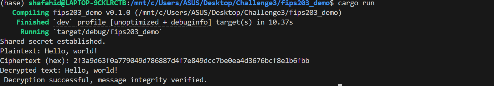
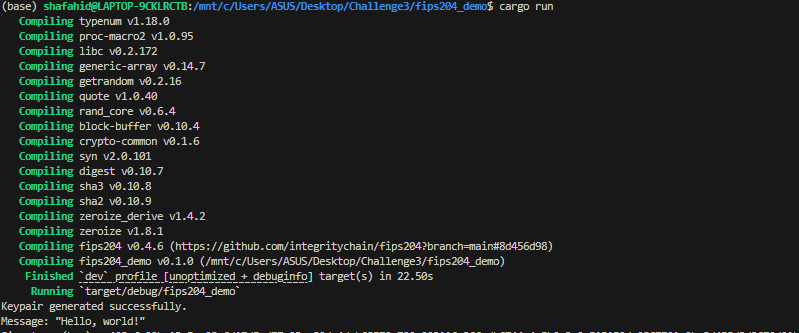
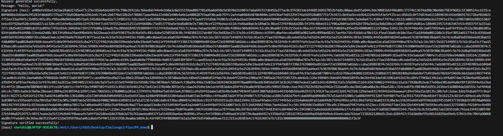
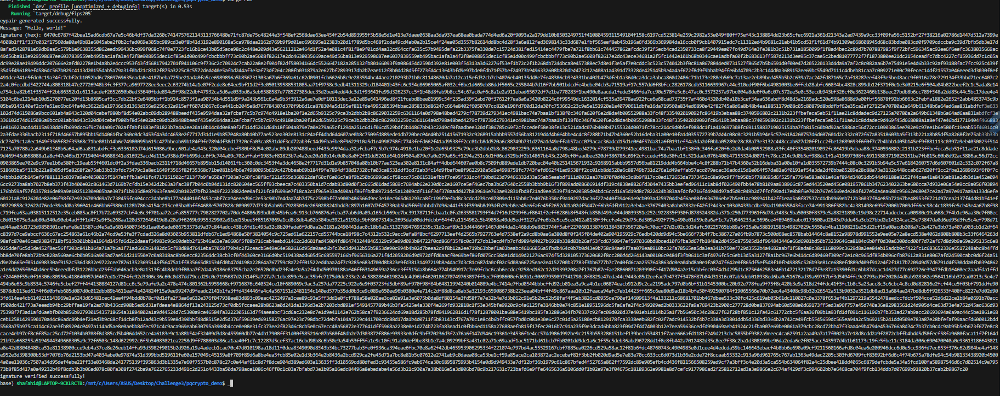

# Module Lattice Based Key Encapsulation Mechanism

This repository provides Rust demo implementations of the NIST Draft Federal Information Processing Standards (FIPS) for post-quantum cryptography, focusing on lattice-based key encapsulation and digital signature schemes designed to resist quantum attacks.

---

## Overview

### FIPS 203 - ML-KEM (Key Encapsulation Mechanism)
- Demonstrated using the `fips203` crate's `ml_kem_512` module.
- Includes key generation, encapsulation, and decapsulation steps.
- Shows usage of the shared secret for AES-256-GCM symmetric encryption.

### FIPS 204 - ML-DSA (Digital Signature Algorithm)
- Demonstrated with the `fips204` crate's `ml_dsa_44` module.
- Includes key generation, message signing, and signature verification.

### FIPS 205 - Stateless Hash-Based Signatures
- Demonstrated using the `fips205` crate's `slh_dsa_shake_128s` module.
- Includes key generation, message signing with context, and signature verification.

---

## Demo Screenshots


```markdown




```

---

## Prerequisites

- Rust toolchain (recommended: latest stable)
- Cargo package manager (comes with Rust)
- Optional: `hex` crate for output formatting (already in dependencies)

---

## Build & Run Instructions

**FIPS 203 demo**
```sh
cd fips203_demo
cargo run
```

**FIPS 204 demo**
```sh
cd fips204_demo
cargo run --bin main-204
```

**FIPS 205 demo**
```sh
cd pqcrypto_demo
cargo run --bin fips205
```

---

## Example Output

### FIPS 203 (Key Encapsulation)
```
Shared secret established.
Plaintext: Hello, world!
Ciphertext (hex): ...
Decrypted text: Hello, world!
Decryption successful, message integrity verified.
```

### FIPS 204 (Digital Signature)
```
Keypair generated successfully.
Message: "Hello, world!"
Signature (hex): ...
Signature verified successfully!
```

### FIPS 205 (Hash-Based Signature)
```
Keypair generated successfully.
Message: "Hello, world!"
Signature (hex): ...
Signature verified successfully!
```

---

## References

- [NIST Post-Quantum Cryptography Project](https://csrc.nist.gov/projects/post-quantum-cryptography)
- [FIPS 203 - ML-KEM Standard](https://csrc.nist.gov/publications/detail/fips/203/draft)
- [FIPS 204 - ML-Digital Signature Standard](https://csrc.nist.gov/publications/detail/fips/204/draft)
- [FIPS 205 - Stateless Hash-Based Signature Standard](https://csrc.nist.gov/publications/detail/fips/205/draft)
- [fips203 Rust crate](https://github.com/Abs-Futy7/Module-Lattice-Based-Key-Encapsulation-Mechanism)
- [fips204 Rust crate](https://github.com/Abs-Futy7/Module-Lattice-Based-Digital-Signature-Algorithm)
- [fips205 Rust crate](https://github.com/Abs-Futy7/Stateless-Hash-Based-Digital-Signature-Algorithm)

---

## License

Specify your project license here (e.g., MIT, Apache 2.0).

